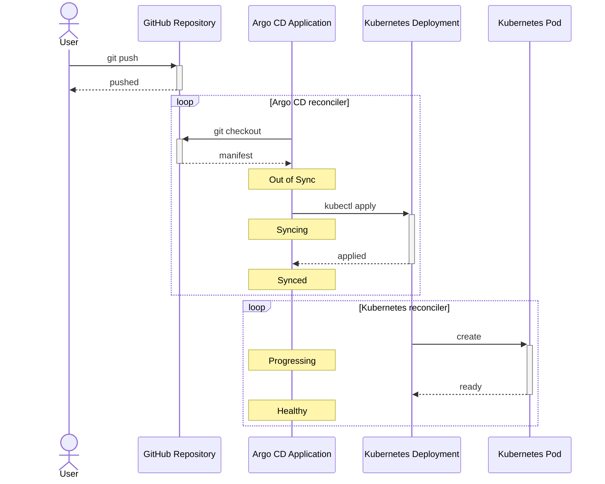
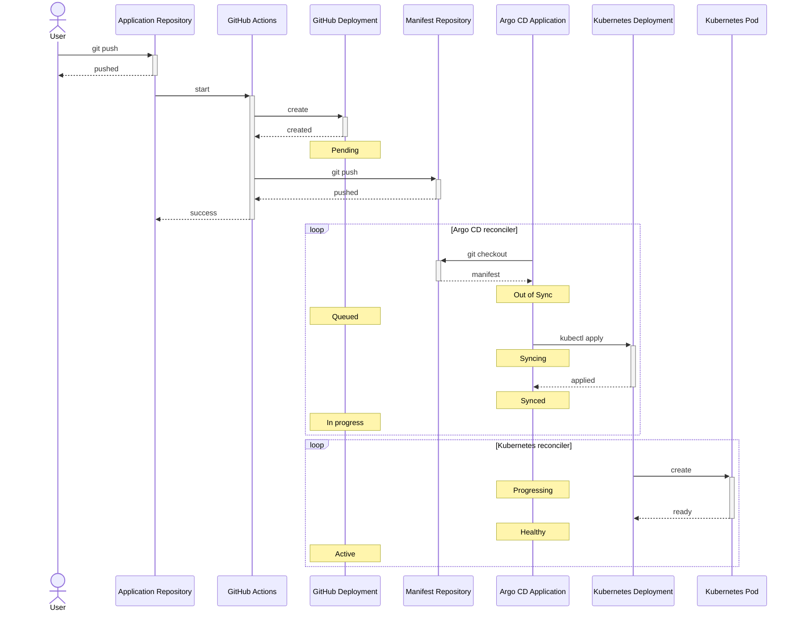

# argocd-commenter [](https://github.com/int128/argocd-commenter/actions/workflows/build.yaml)

This is a Kubernetes Controller to notify a change of Argo CD Application status.

## Example: Pull Request notification

In the [GitOps](https://www.weave.works/technologies/gitops/) way, you merge a pull request to deploy a change to Kubernetes cluster.
argocd-commenter allows you to receive a notification comment after merging.

When an Application is syncing, synced or healthy, argocd-commenter will create a comment.


When the sync was failed, argocd-commenter will create a comment.


See the examples in [e2e-test fixtures](https://github.com/int128/argocd-commenter-e2e-test/pulls?q=is%3Apr+is%3Aclosed).

### Sequence diagram

Here is the sequence diagram of the deployment flow.



## Example: GitHub Deployment notification

In a complex deployment flow, you can receive a notification using GitHub [Deployments](https://docs.github.com/en/rest/reference/deployments) API.
For example, when you deploy a preview environment for a pull request, you can receive the deployment statuses.

To receive a deployment status, set the following annotation to the Argo CD Application:

```yaml
apiVersion: argoproj.io/v1alpha1
kind: Application
metadata:
  annotations:
    argocd-commenter.int128.github.io/deployment-url: https://api.github.com/repos/OWNER/REPO/deployments/ID
```

Here is an example of workflow to deploy a preview environment:

```yaml
jobs:
  deploy:
    steps:
      # Create a deployment
      - uses: int128/deployment-action@v1
        id: deployment

      # Generate the manifests for a preview environment
      - uses: actions/checkout@v2
        with:
          repository: your/manifests-repository
          path: manifests-repository
          token: # PAT or GitHub App token is required to write
      - run: |
          cp -a manifests "manifests-repository/pr-${{ github.event.pull_request.number }}"
          cd "manifests-repository/pr-${{ github.event.pull_request.number }}"
          sed -e 's|DEPLOYMENT_URL|${{ steps.deployment.outputs.url }}|g' applications/*.yaml

      # Push the manifests for a preview environment
      - run: |
          git add .
          git commit -m 'Deploy pr-${{ github.event.pull_request.number }}'
          git push manifests-repository main
```

When the Application status is changed, argocd-commenter will create a deployment status.


See the [e2e test](https://github.com/int128/argocd-commenter/blob/main/.github/workflows/build.yaml) for details.

### Sequence diagram

Here is the sequence diagram of the deployment flow.



## Getting Started

### Prerequisite

Argo CD is running in your Kubernetes cluster.

### Setup

To deploy the manifest:

```shell
kubectl apply -f https://github.com/int128/argocd-commenter/releases/download/v1.8.0/argocd-commenter.yaml
```

You need to create either Personal Access Token or GitHub App.

- Personal Access Token
  - Belong to a user
  - Share the rate limit in a user
- GitHub App
  - Belong to a user or organization
  - Have each rate limit for an installation

#### Option 1: Using a Personal Access Token

1. Open https://github.com/settings/tokens
1. Generate a new token
1. Create a secret as follows:
   ```shell
   kubectl -n argocd-commenter-system create secret generic controller-manager \
     --from-literal="GITHUB_TOKEN=$YOUR_PERSONAL_ACCESS_TOKEN"
   ```

#### Option 2: Using a GitHub App

1. Create your GitHub App from either link:
   - For a user: https://github.com/settings/apps/new?name=argocd-commenter&url=https://github.com/int128/argocd-commenter&webhook_active=false&contents=read&pull_requests=write
   - For an organization: https://github.com/organizations/:org/settings/apps/new?name=argocd-commenter&url=https://github.com/int128/argocd-commenter&webhook_active=false&contents=read&pull_requests=write (replace `:org` with your organization)
1. Get the **App ID** from the setting page
1. [Download a private key of the GitHub App](https://docs.github.com/en/developers/apps/authenticating-with-github-apps)
1. [Set a custom badge for the GitHub App](https://docs.github.com/en/developers/apps/creating-a-custom-badge-for-your-github-app)
   - Logo of Argo CD is available in [CNCF Branding](https://cncf-branding.netlify.app/projects/argo/)
1. [Install your GitHub App on your repository or organization](https://docs.github.com/en/developers/apps/installing-github-apps)
1. Get the **Installation ID** from the URL, like `https://github.com/settings/installations/ID`
1. Create a secret as follows:
   ```shell
   kubectl -n argocd-commenter-system create secret generic controller-manager \
     --from-literal="GITHUB_APP_ID=$YOUR_GITHUB_APP_ID" \
     --from-literal="GITHUB_APP_INSTALLATION_ID=$YOUR_GITHUB_APP_INSTALLATION_ID" \
     --from-file="GITHUB_APP_PRIVATE_KEY=/path/to/private-key.pem"
   ```

### Verify setup

Make sure the controller is running.

```shell
kubectl -n argocd-commenter-system rollout status deployment argocd-commenter-controller-manager
```

## Configuration

### GitHub Enterprise Server

Set the environment variable `GITHUB_ENTERPRISE_URL`.

```shell
kubectl -n argocd-commenter-system create secret generic controller-manager \
  --from-literal="GITHUB_TOKEN=$YOUR_PERSONAL_ACCESS_TOKEN" \
  --from-literal="GITHUB_ENTERPRISE_URL=$YOUR_GITHUB_ENTERPRISE_URL"
```

## Contribution

This is an open source software. Feel free to contribute to it.
