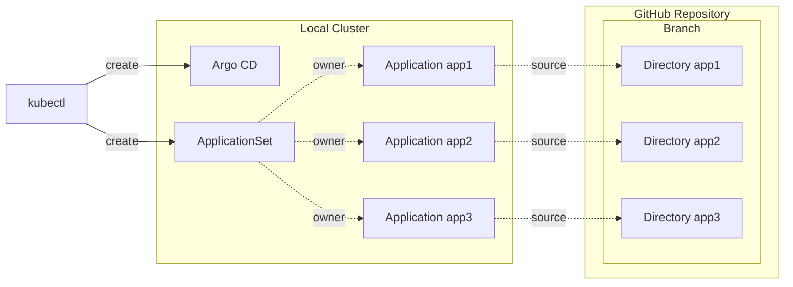

# E2E test for argocd-commenter

## Test environment

Here is a diagram of the test environment.



## Local development

### Prerequisites

- docker
- kind
- kustomize
- kubectl
- make
- git
- gh

### How to run

Set up a branch to deploy.

```sh
gh repo clone int128/argocd-commenter-e2e-test argocd-commenter-e2e-test-repository
make setup-fixture-branch
```

Set up a cluster and Argo CD.

```sh
make cluster
make deploy-argocd
make wait-for-apps
```

You can access the cluster.

```console
% export KUBECONFIG=output/kubeconfig.yaml
% k -n argocd get apps
NAME   SYNC STATUS   HEALTH STATUS
app1   Synced        Progressing
app2   Synced        Progressing
app3   Synced        Healthy
```

You can run the controller locally.

```sh
make -C .. run
```

### Clean up

```sh
make delete-cluster
```
